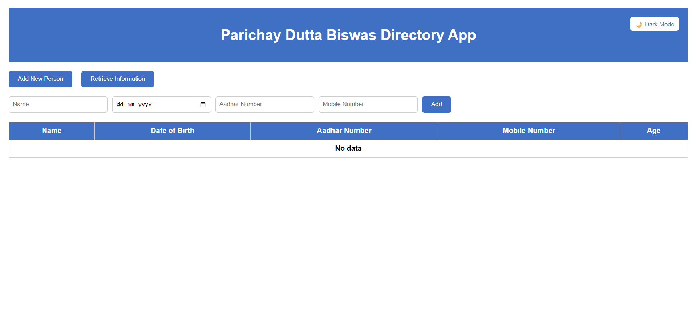
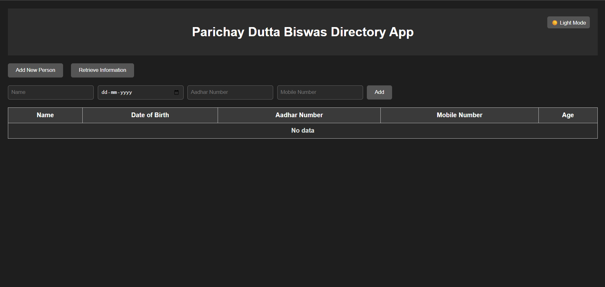

# 📇 Directory App

A responsive and user-friendly Directory App built with **React.js** using **Vite**, developed by **Parichay Dutta Biswas**. This app allows users to add and manage personal contacts with features like dark mode support and real-time data rendering.

## 🔗 Hosted Link

👉 [Live Demo](https://parichay-directory.netlify.app/)

## 🚀 Features

- 🔍 Add and view contact details
- 🌗 Dark mode toggle (applied to the entire screen)
- ⚡ Built with Vite for fast development and build speed
- ♻️ Fully responsive design
- 🧠 Uses React Hooks like `useState` and `useEffect`
- 🔒 Local storage support for data persistence

## 📸 Screenshots

| Light Mode | Dark Mode |
|------------|-----------|
|  |  |

## 🛠️ Tech Stack

- **Frontend**: React.js, Tailwind CSS (optional for styling), JavaScript
- **Build Tool**: Vite
- **State Management**: React Hooks

## 📂 Project Structure

